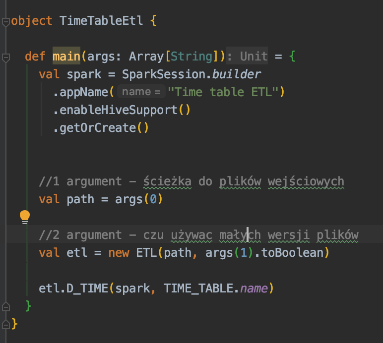
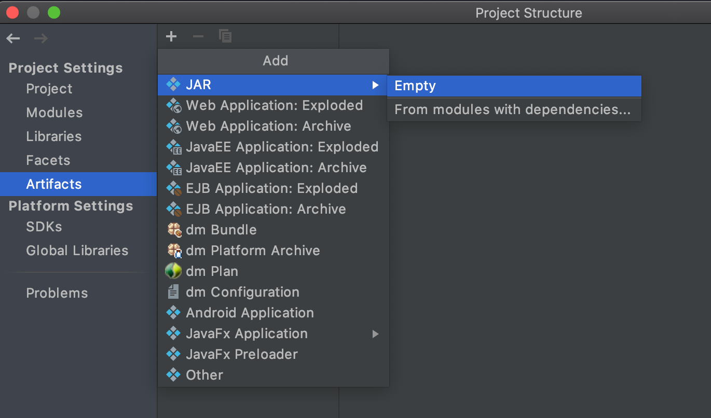
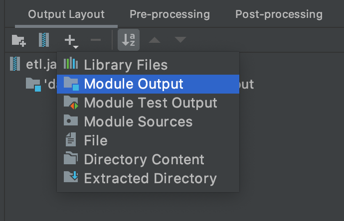
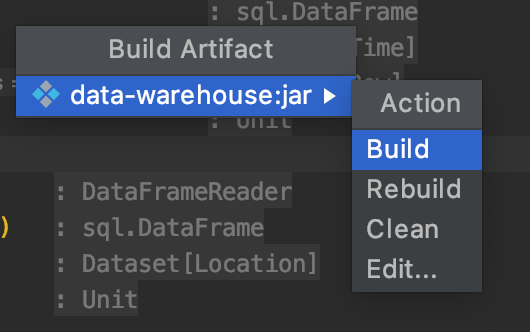

### Tworzenie jara
1. Stwórz obiekt ETLa z metodą main w pakiecie `executables`. Wykorzystaj klasę ETL. 
Ważne żeby dodać `enableHiveSupport()` i parametryzować ścieżki do plików jak w przykładzie.

1. Wybierz `File > Project Structure > Artifacts`
Kliknij `+` w lewym górnym rogu. Wybierz `JAR` a następnie 
`empty`

1. Kliknij `+` wybierz `Module Output` a następnie `data-warehouse`

1. Wybierz `Build > Build Artifacts...`. Z listy wybierz swojego jara 
i kliknij `Build`. 

1. Jar zostanie umieszczony w folderze `out/artifcats`

### Odpalanie na klastrze
1. pobierz pliki wejściowe do pamięci klastra i rozpakuj je używając komend:

        wget https://www.cs.put.poznan.pl/kjankiewicz/bigdata/projekt2/uk-trafic.zip
        unzip uk-trafic.zip
    
1. pobierz na klaster `etl.jar` oraz `hivetables.scala` 
        
        gsutil cp gs://<bucket-name>/<folder>/etl.jar .
        gsutil cp gs://<bucket-name>/<folder>/hivetables.scala .
        
1. stwórz folder na pliki wejściowe na hdfs 

        hadoop fs -mkdir -p input_data
        
1. przekopiuj pliki wejściowe z klastra na hdfs 
        
        hadoop fs -copyFromLocal uk-trafic/* input_data/
 
1. uruchom skrypt tworzący tabele w Hive:
    
        spark-shell -i hivetables.scala

1. odpal etla wskazując odpowiednią klasę oraz folder na HDFS, gdzie znajdują się piliki wejściowe. PRZYKŁAD:
        
        spark-submit --class warehouse.executables.TimeTableEtl \
        --master yarn --num-executors 5 --driver-memory 512m \
        --executor-memory 512m --executor-cores 1 etl.jar input_data

zmieniająć parametr `--class` na jedną z klas w `executables` uruchamiamy wybranego ETLA 
Ostatni argument oznacza folder z plikami wejściowymi 

### Odpalanie wszystkiego 
```
spark-submit --class warehouse.executables.RegionAuthorityTableEtl \
--master yarn --num-executors 5 --driver-memory 512m \
--executor-memory 512m --executor-cores 1 etl.jar input_data

spark-submit --class warehouse.executables.TimeTableEtl \
--master yarn --num-executors 5 --driver-memory 512m \
--executor-memory 512m --executor-cores 1 etl.jar input_data

spark-submit --class warehouse.executables.RoadTableEtl \
--master yarn --num-executors 5 --driver-memory 512m \
--executor-memory 512m --executor-cores 1 etl.jar input_data

spark-submit --class warehouse.executables.VehicleTypeTableEtl \
--master yarn --num-executors 5 --driver-memory 512m \
--executor-memory 512m --executor-cores 1 etl.jar input_data

spark-submit --class warehouse.executables.WeatherTableEtl \
--master yarn --num-executors 5 --driver-memory 512m \
--executor-memory 512m --executor-cores 1 etl.jar input_data

spark-submit --class warehouse.executables.RidesFactsTableEtl \
--master yarn --num-executors 5 --driver-memory 512m \
--executor-memory 512m --executor-cores 1 etl.jar input_data
```
### Zeppelin
Zaimportuj plik `Zeppelin_Analysis.json` do Zeppelina i uruchom.
